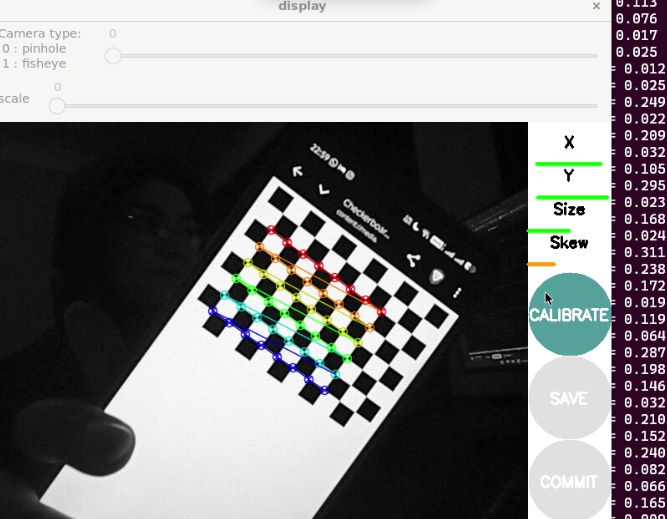

# KUBRA NUR TIRYAKI
# orbslam3-droidcam-noetic
ROS Noetic üzerinde ORB-SLAM3 (Monocular) + DroidCam (telefon kamerası) ile çalışan örnek kurulum/çalıştırma akışı.

Bu repo; telefon kamerasını MJPEG üzerinden ROS topic’ine çevirme, kamera kalibrasyonu alma, ORB-SLAM3 monocular çalıştırma ve monocular “ölçek belirsizliği” için ölçüm + pose ölçekleme araçlarını içerir.

## Hızlı Başlangıç (Çalıştırma Akışı - Özet)
1) roscore
2) DroidCam → ROS image_raw/camera_info
3) (Bir kere) camera_calibration ile intrinsics çıkar ve YAML’e yaz
4) ORB-SLAM3 monocular çalıştır
5) RViz ile 3D iki nokta tıklayıp SLAM mesafesi ölç
6) scale = real/slam
7) pose’u scale ile yayınla (`/orb_slam3/camera_pose_scaled`)

---

## İçindekiler
- 1) Önkoşullar
- 2) Build
- 3) Çalıştırma Akışı (Özet)
- 4) Kamera Kalibrasyonu
- 5) ORB-SLAM3 Çalıştırma (Monocular)
- 6) Görüntü İzleme
- 7) 3D Mesafe Ölçümü (RViz ile iki nokta arası)
- 8) Pose Ölçekleme (Monocular scale düzeltme)
- Scriptler (bu repoda eklenenler)
- Sık karşılaşılan sorunlar

---

## 1) Önkoşullar
- Ubuntu 20.04 + ROS Noetic
- catkin_tools
- ORB-SLAM3 bağımlılıkları (repo içindeki `Dependencies.md` / mevcut kurulum)
- DroidCam (telefon app) veya MJPEG stream verebilen benzeri bir uygulama

Gerekli ROS paketleri:
```bash
sudo apt update
sudo apt install -y python3-catkin-tools \
  ros-noetic-cv-bridge ros-noetic-image-transport \
  ros-noetic-camera-info-manager ros-noetic-camera-calibration \
  ros-noetic-rqt-image-view ros-noetic-rviz
```
## 2) Build
```
cd ~/catkin_ws
catkin build orb_slam3_ros
source ~/catkin_ws/devel/setup.bash
```
## 3) Çalıştırma Akışı (Özet)
3 terminal mantığı ile ilerle:

### Terminal-1: ROS master
```
source /opt/ros/noetic/setup.bash
roscore
```
### Terminal-2: 
DroidCam -> ROS /camera/image_raw
TELEFON_IP kısmını kendi IP’n ile değiştir.
```
source /opt/ros/noetic/setup.bash
source ~/catkin_ws/devel/setup.bash

rosrun orb_slam3_ros droidcam_mjpeg_to_ros.py __ns:=/camera \
  _url:=http://TELEFON_IP:4747/video \
  _max_fps:=30
```
Stream kontrolü:
```
rostopic hz /camera/image_raw
```

### Terminal-3: ORB-SLAM3 monocular

```
source /opt/ros/noetic/setup.bash
source ~/catkin_ws/devel/setup.bash

roslaunch orb_slam3_ros webcam_mono.launch enable_pangolin:=false

```
ORB terminalinde Camera Parameters: altında fx/fy/cx/cy görüyorsan settings dosyası doğru okunuyor demektir.

## 4) Kamera Kalibrasyonu
Kalibrasyon için satranç tahtası kullanılır. Kameraya yaklaştırıp uzaklaştırma, görüntüyü eğme vs gerek.
----------------------------------------------------------BURAYA RESMİ KOYCAM



```
rosrun camera_calibration cameracalibrator.py --size 8x6 --square 0.025 \
  image:=/camera/image_raw camera:=/camera
```
Kalibrasyon bitince camera_info kontrol:
```
rostopic echo -n 1 /camera/camera_info | egrep "width:|height:|distortion_model:|D:|K:"
```
Bu değerleri ORB settings dosyana yaz:
config/Monocular/MyWebcam.yaml içindeki:
Camera.fx, Camera.fy, Camera.cx, Camera.cy
Camera.k1, Camera.k2, Camera.p1, Camera.p2, Camera.k3

## 5) ORB-SLAM3 Çalıştırma (Monocular)

```
roslaunch orb_slam3_ros webcam_mono.launch enable_pangolin:=false
```
LOST azaltmak için pratik öneriler:

İyi ışık + dokulu yüzey (düz beyaz duvar kötü)
Yavaş hareket
Paralaks oluştur: sağ/sol + ileri/geri hareket

## 6) Görüntü İzleme
Telefonun ham görüntüsü:
```
rosrun rqt_image_view rqt_image_view /camera/image_raw
```
rosrun rqt_image_view rqt_image_view /orb_slam3/tracking_image
```
rosrun rqt_image_view rqt_image_view /orb_slam3/tracking_image
```

## 7) 3D Mesafe Ölçümü (RViz ile iki nokta arası)

ORB point cloud topic’leri:
  /orb_slam3/tracked_points
  /orb_slam3/all_points

RViz’te:
  Fixed Frame: map (veya ORB’nin frame’i)
  PointCloud2 display ekle -> /orb_slam3/all_points
  Tool: Publish Point ile iki nokta tıkla

Bu iki script RViz’ten tıklanan 2 nokta arasını ölçmek için kullanılır:
  scripts/measure_clicked_distance.py
  scripts/orb_ruler_3d_measure.py

## 8) Pose Ölçekleme (Monocular scale düzeltme)
Monocular SLAM metreyi doğrudan bilemez (scale ambiguity). Ölçek düzeltme akışı:
  Gerçekte bildiğin bir mesafe seç (ör: 0.60 m)
  RViz ile aynı iki noktanın SLAM mesafesini ölç (ör: 0.3613684)
  scale = real / slam (ör: 0.60 / 0.3613684 = 1.66025)
  Pose pozisyonunu scale ile çarpıp yeni topic yayınla
Ölçekleme scripti:
  scripts/orbslam_scale_pose.py
  input: /orb_slam3/camera_pose
  output: /orb_slam3/camera_pose_scaled
Çalıştırma:

```
rosrun orb_slam3_ros orbslam_scale_pose.py _scale:=1.66025

```
_scale: değerini kendiniz hesaplamalısınız.

## Scriptler (bu repoda eklenenler)
scripts/droidcam_mjpeg_to_ros.py
  MJPEG stream’i /camera/image_raw + /camera/camera_info olarak yayınlar
  /camera/set_camera_info servisini sağlar (camera_calibration bunu kullanır)
scripts/measure_clicked_distance.py / scripts/orb_ruler_3d_measure.py
  RViz’te tıklanan iki 3D nokta arasını hesaplar (SLAM units)
scripts/orbslam_scale_pose.py
  PoseStamped pozisyonunu scale ile çarpıp yeni topic yayınlar


## Sık karşılaşılan sorunlar
### “Connection refused” sonra “Stream opened”
Telefon uygulaması geç açılıyorsa veya ağ gecikmesi varsa görülebilir. Stream açılınca düzelir.

###ORB sürekli LOST
  Yüzey dokusuz (beyaz duvar) olabilir
  Işık az olabilir
  Çok hızlı hareket olabilir
  Kamera kalibrasyonu / fx-fy yanlış olabilir
  Çok az parallax (sadece sağa sola değil, ileri/geri de yap)
  
